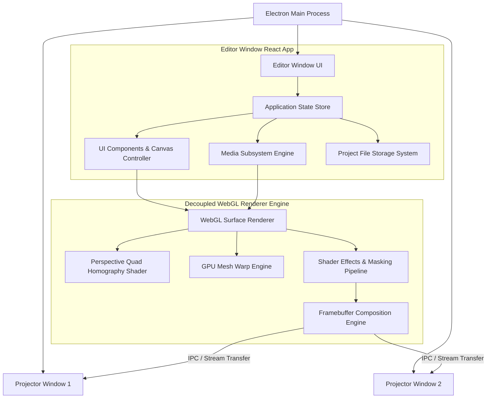

# LUMORA Architecture Overview

## System Architecture Diagram

## Core Principles

1. **Separation of UI and Graphics Rendering:**  
   React handles UI interactions, menus, inspectors, and timelines. The WebGL graphics engine runs in an isolated frame loop to maintain a solid 60 FPS independent of UI state updates.

2. **Modular Subsystems:**  
   - **`src/main/`**: Electron process management, window creation, display enumeration, file IPC, native dialogs.
   - **`src/ui/`**: React UI components, layout grid, dark theme styling tokens, keyboard handlers.
   - **`src/renderer/`**: Decoupled WebGL 2.0 rendering pipeline, quad corner pinning matrix math, mesh warping calculations.
   - **`src/media/`**: Video element pools, image texture loaders, playback speed synchronization, metadata extraction.
   - **`src/project/`**: `.lumora` zip container archiver, JSON schema validators, autosave daemon, project migration.
   - **`src/show/`**: Cue triggering, scene transitions, emergency blackout and whiteout test patterns.
   - **`src/output/`**: Multi-display detection, fullscreen window positioning, projector calibration test patterns.

3. **Data Flow:**  
   `UI Action` -> `Application State` -> `Renderer Ref / Frame State` -> `GPU Draw Calls` -> `Display Output`.
